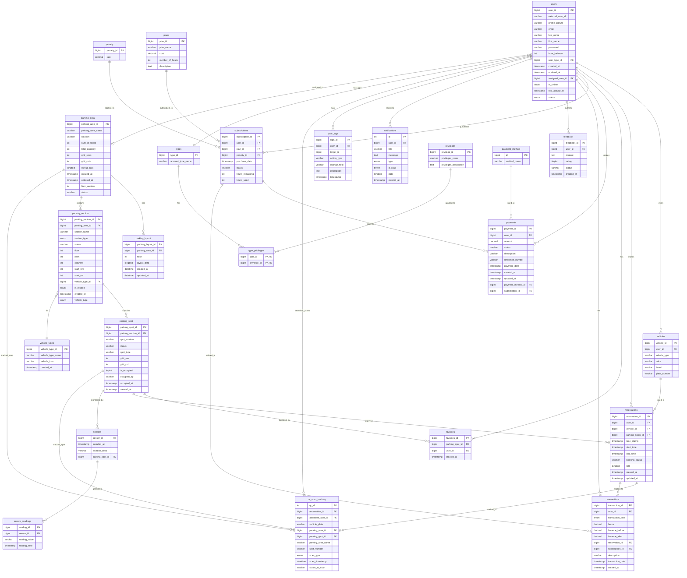

# Tappark Database ERD (Entity Relationship Diagram)

## Complete Database Schema

## Table Summary

### Core Entities (22 tables total)

1. **users** - User accounts with authentication and profile information
2. **types** - User account types (Subscriber, Attendant, Admin)
3. **type_privileges** - Junction table linking user types to privileges
4. **privileges** - Available system privileges/permissions
5. **vehicles** - User vehicles
6. **vehicle_types** - Vehicle type definitions (Car, Motorcycle, Bicycle)

### Parking Infrastructure

7. **parking_area** - Parking lots/areas
8. **parking_layout** - Layout configurations for parking areas
9. **parking_section** - Sections within parking areas
10. **parking_spot** - Individual parking spots
11. **sensors** - IoT sensors monitoring parking spots
12. **sensor_readings** - Sensor data readings

### Reservations & Bookings

13. **reservations** - Parking spot reservations
14. **favorites** - User favorite parking spots

### Subscriptions & Payments

15. **plans** - Subscription plans (hour packages)
16. **subscriptions** - User subscriptions to plans
17. **penalty** - Penalty rates
18. **payments** - Payment records
19. **payment_method** - Payment method types (Cash, GCash, Credit Card)
20. **transactions** - Hour balance transactions

### System & Logging

21. **notifications** - User notifications
22. **feedback** - User feedback/reviews
23. **user_logs** - User activity logs
24. **qr_scan_tracking** - QR code scan tracking logs (with FK to parking_spot and parking_area)

## Key Relationships

- **users** is central, connecting to most entities
- **parking_area** → **parking_section** → **parking_spot** (hierarchical structure)
- **reservations** link users, vehicles, and parking spots
- **subscriptions** connect users to plans and generate payments/transactions
- **types** and **privileges** control user permissions via **type_privileges**

